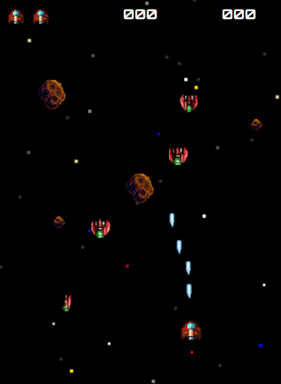

#### C.E. DVRV

### Programación y Motores de Videojuegos

#### Project: Asteroids

`[Unity ver.: 6.0.25f1]`

## Diseño

### Concepto

- **Título:** Asteroids

- **Plataforma:** PC

- **Género:** Shoot’em up, Arcade, Casual

- **Cámara:** Juego 2D con vista cenital

- **Descripción:**

  - Juego para un jugador en el que el objetivo es manejar una nave espacial  a través de un campo de asteroides y evitar ser destruido por colisión con los asteroides o naves enemigas.

  - La nave dispone de un cañón laser con el que puede disparar y destruir tanto los asteroides como las naves enemigas.

### Elementos de diseño

### Mecánicas

- El jugador maneja su nave en cualquier dirección, sin poder abandonar la zona de juego.

- Fondo estrellado con scroll continuo vertical.

- Las naves enemigas aparecen por la parte superior de la pantalla y se mueven verticalmente hacia abajo.

- Los meteoritos aparecen por los laterales. Se mueven horizontalmente, rebotando en los laterales y también verticalmente hacia abajo.

- Si la nave del jugador colisiona con un asteroide o con una nave enemiga, se destruye y pierde una vida.

- Si el jugador pierde todas sus vidas, el juego finaliza.

- La nave del jugador dispone de un cañón laser con el que puede disparar y destruir las naves enemigas y los asteroides, lo cual le dará puntos.

- La destrucción de un asteroide grande lo dividirá en dos pequeños que continuarán avanzando.

- El juego mostrará la puntuación actual del jugador.

- Se dispondrá de un sistema que permita registrar la puntuación máxima alcanzada (high-score) que estará visible durante el juego.

- Se reproducirán sonidos en los disparos, las destrucciones y las colisiones.

- Se reproducirá una música de fondo.

- La nave enemiga tendrá una animación de forma que haga un movimiento de giro sobre su eje longitudinal.

- Existirán animaciones para las distintas explosiones.

### Mecánicas adicionales (práctica)

- Pantallas de inicio, detención y fin de juego.
